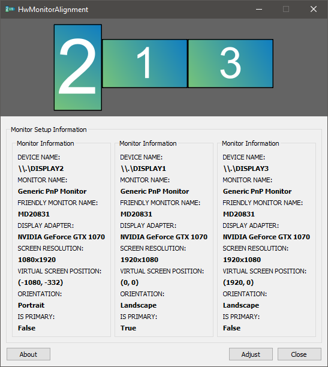

`HwMonitorAlignment` is a tool to align your multi-monitor setup perfectly in Windows.

Developed for Microsoft Windows 10. *The APIs used should be backwards compatible, but have not yet been officially tested.*

## Usage
1. Download and run the program. Sometimes it may take a while to start.
2. Make sure all monitors connected to your computer are visible. 
3. Click the `Adjust` button. Lines will appear on the screens
	+ Move the cursor to the screen where the lines do not match those of the primary.
	+ Click once on the screen to select it.
4. Now move the lines up and down with <kbd>&#8593;</kbd> (Up Arrow) or <kbd>&#8595;</kbd> (Down Arrow)
	+ Use <kbd>Page Up</kbd> and <kbd>Page Down</kbd> to move faster
5. Align the lines on the screen with those on the primary and click `Apply`.
6. The tool now applies the new configuration.
	+ A dialog with a timer appears. If something goes wrong, the old settings will be applied again after 15 seconds.
7. Have fun with no more hight-changing windows!

## Installation
This tool was written in Python 3.7 and compiled into an binary with PyInstaller, so you have two options:

1. Download the `hwmonitoralignment` binary from Releases tab.
2. Clone this repository and start it up with Python 3.7
	+ `C:\> git clone https://github.com/Chrisg2000/HwMonitorAlignment.git`
	+ `C:\> pip install -r requirements.txt`
	+ `C:\> python hwa.py`

## Description
The tool uses the concept of the [virtual screen][1]. The virtual screen is the bounding rectange of all connected monitors to the computer. The primary screen contains the coordinate system origin (0,0) in the upper left corner.

It is not necessary that the origin is in the upper left corner of the virtual screen, so positions on it can be negative. 
The coordinates of a monitor always point to the upper left corner. By moving the monitor on the virtual screen the monitors can be aligned to each other.

## Contributing
Clone the repository and start programming! I am looking forward to any pull request and ready to discuss it.

## Personal Note
This is the first project I have published. Due to my limited experience in "end-user" program development, I may have made mistakes. The program was often subject to decision changes during development, so some areas may not seem consistent.
I have sometimes been inspired by the source code of [Linux Show Player][2], so maybe some parallels can be found between the source code. Linux Show Player is a great software, not only in terms of usage, but also in terms of its elegant structure. I took basic concepts like the signal and the basic implementation from the model and built on them.

## License
This project is licensed under the GPL License - see the [LICENSE][3] file for details

[1]: https://docs.microsoft.com/en-us/windows/win32/gdi/the-virtual-screen
[2]: https://github.com/FrancescoCeruti/linux-show-player
[3]: LICENSE

